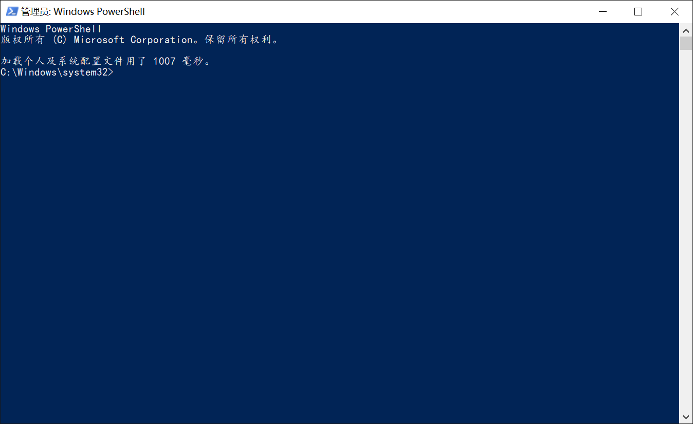

#  CMD / Powershell / WSL 环境美化 (绣花)

## 为什么需要美化？

Windows默认的蓝底白字的Powershell（图一），黑底白字的CMD（图二）和WSL（图三）观感极差，
再配上默认的楷体等非等宽字体，以及zsh中的powerline字符乱码（图三），在日常使用中非常不友好。


（图一）


（图二）


（图三）

经过美（xiu）化（hua）后，可以达到图四的效果：


（图四）

## 使用cmder美化界面

首先，解决界面不够美观的方法很简单，只需要一个软件：cmder。
cmder基于另一款console模拟器ConEmu (https://conemu.github.io/)，并进步一加以改进，
在官网 (https://cmder.net/) 下载一个完整版解压后即可使用，可以按照自己的需求进行一些配置。

配置时最好用管理员身份运行cmder，否则配置可能无法写入系统，在Settings中，找到Startup - Tasks，
此时cmder已经自动生成了系统中所有支持shell的列表，如图五：


（图五）

其中已经有cmd，Powershell和WSL等shell的启动选项，在这里可以设置Default task for new console，
需要注意的是这个选项并不是指启动cmder时自动启动的shell，而是New console dialog中默认的shell。

如果需要配置默认启动的shell，应该在第一个General选项中选择（图六），
同时也可以设置语言（作为JI的学生应该使用默认的英文就好了），
字体（Fonts，建议换为Poweline字体，详见后文）
和主题（Features - Colors，图四为Solarized主题）


（图六）

## 使用zsh美化shell (WSL)

在 WSL (Windows Subsystem for Linux) 中，默认shell为bash。
诚然，bash在经过一些繁杂的配置后也有很好的使用体验，但本人更推荐使用oh-my-zsh进行一键配置和美化。

首先确保WSL中已经安装zsh，git和curl，并下载oh-my-zsh安装脚本：

```bash
sudo apt install zsh git curl
sh -c "$(curl -fsSL https://raw.githubusercontent.com/robbyrussell/oh-my-zsh/master/tools/install.sh)"
```

安装过程中需要输入密码将默认的登录shell改为zsh，然后可以在`~/.zshrc`中修改配置。
在官方github上，有大部分主题的截屏展示，可以选择其中之一（或多个）成为默认（或轮换）主题。


（图七：选择agnoster作为默认主题）
